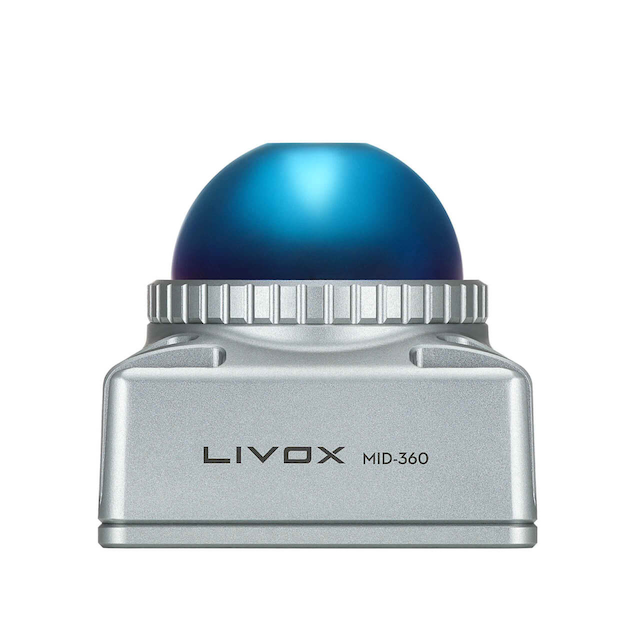
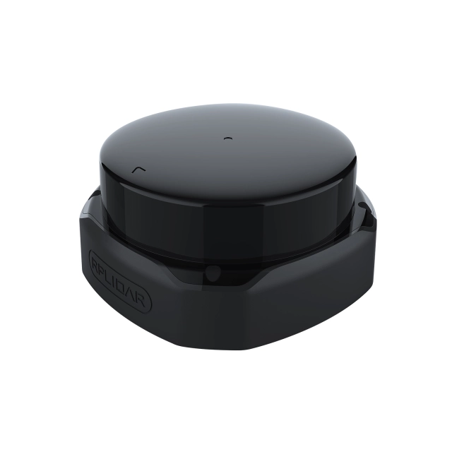
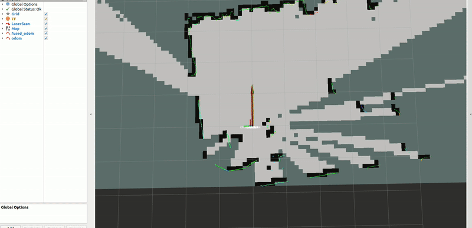
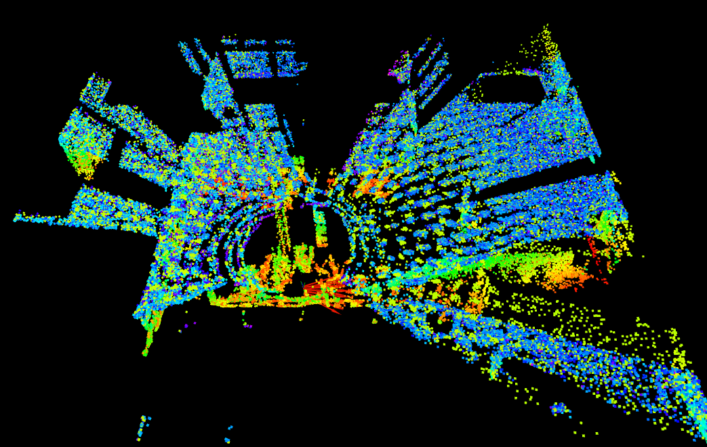

# olvx_playground_imu
Simple C++ / Python ROS 2 package/node to start working with the [olixSense™ X1
IMU (Inertial Measurement Unit)](https://olive-robotics.com/olixsense-imu-x1/).

## Table of Contents
<!-- TOC -->
* [olvx_playground_imu](#olvx_playground_imu)
  * [Table of Contents](#table-of-contents)
  * [Tested Hardware](#tested-hardware)
  * [Examples](#examples)
    * [Shake Detector](#shake-detector)
    * [North Detector](#north-detector)
    * [2D SLAM](#2d-slam)
    * [3D SLAM](#3d-slam)
    * [OWL Educational Kit](#owl-educational-kit)
    * [ANT Educational Kit](#ant-educational-kit)
<!-- TOC -->

## Tested Hardware

| Livox MID-360 LiDAR                         | RPLidar S2E                               |
|---------------------------------------------|-------------------------------------------|
|  |  |
|                                             |                                           |

## Examples
### Shake Detector

Quickly and easily determine shaking or vibration using your Olive IMU.

Read More: [README.md](examples/01-Shake-Detector/README.md)
### North Detector

Find true north using the built-in magnetometer. 

Read More: [README.md](examples/02-North-Detector/README.md)

### 2D SLAM

Power a 2D LiDAR sensor using your IMU's directional functionality.

Read More: [README.md](examples/03-SLAM-RPLiDAR/README.md)

### 3D SLAM

Power a 3D LiDAR sensor using your IMU's directional functionality.

Read More: [README.md](examples/04-SLAM-LivoxLiDAR/README.md)

### OWL Educational Kit

The OWL Educational Kit is powered by the Olive IMU.

Read More: [README.md](examples/05-OWL-Educational-Kit/README.md)

### ANT Educational Kit

The ANT Educational Kit is powered by the Olive IMU.

Read More: [README.md](examples/06-ANT-Educational-Kit/README.md)
