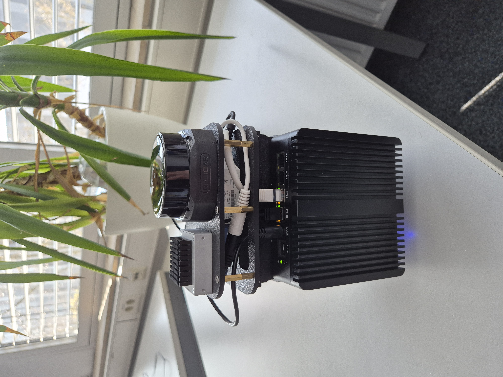

# Olive SLAM with IMU and LiDAR

This example shows a ROS 2 2D LiDAR based SLAM fused with the **Olive Robotics IMU olixSense IMU/AHRS E1** build on a Sensor RIG.

As LiDAR the RPLIDAR S2E from Slamtec is used.

The used packages are `robot_locatization` to fuse the IMU and LiDAR with the extended kalman filter, `rf2o` to get odometry based on LiDAR, `slam_toolbox` as slam framework and some own written nodes to sync the sensors and publish the transforms.

<p float="left">
   

</p>

## Table of Contents
<!-- TOC -->
* [Olive SLAM with IMU and LiDAR](#olive-slam-with-imu-and-lidar)
  * [Table of Contents](#table-of-contents)
  * [Dependencies](#dependencies)
  * [Getting Started](#getting-started)
    * [Installation & Setup](#installation--setup)
    * [Setup the sensor rig](#setup-the-sensor-rig)
    * [Start the demo](#start-the-demo)
  * [References](#references)
<!-- TOC -->

## Dependencies
- `ROS 2 Humble`: The Humble Distro of ROS 2
- `colcon`: To build the ROS 2 packages, colcon is needed and can be installed with `sudo apt install python3-colcon-common-extensions`
- `rosdep` can be installed with `sudo apt-get install python3-rosdep`

## Getting Started

### Installation & Setup
1. Setup a ROS 2 workspace
2. Copy the whole example (02-Navigation) into the `src` directory
3. To install the slam_toolbox run following command
```bash
sudo apt install ros-humble-slam-toolbox
```
4. Install necessary dependencies
 - Run `rosdep init` if necessary
 - Run following command to install the dependencies
```bash
rosdep update  && rosdep install --from-paths src --ignore-src -r -y --rosdistro humble
```
5. Build the packages, this may take a while
```bash
colcon build --symlink-install
```
6. Source the workspace
```bash
source install/setup.bash
```

### Setup the sensor rig
The following image shows the used sensor rig for this example



1. Connect the LiDAR and the IMU with the Computer
2. Set an IP address of your Computer for the IMU LAN port: It should be something with 192.168.7.x (not 100).
3. Check if the LiDAR and the IMU topics are available
4. Adjust the tf links if necessary under `src/sensor_rig_transform_publisher/config/transforms.yaml`

### Start the demo

*Hint: Please check carefully which of these nodes you need. If for example the LiDAR and the odometry in your application are already synched you can skip step 4*

1. Start the tf publisher with following command
```bash
ros2 launch sensor_rig_transform_publisher sensor_rig_tf_broadcaster.launch.py 
```
2. Start the lidar node 
```bash
ros2 launch sllidar_ros2 view_sllidar_s2e_launch.py
```
In this case the lidar node also runs rviz2, otherwise you can start rviz2 by itself the config can be found in `src/sllidar_ros2/rviz`

3. Start the laser to odom node
```bash
ros2 launch rf2o_laser_odometry rf2o_laser_odometry.launch.py
```
4. Run the synchonization node 
```bash
ros2 run sync_republish_cpp sync_republish_node
```
It could be possible, that you have to adjust the topics into the code itself

5. Run the slam toolbox node (if necessary adjust the paths)
```bash
ros2 launch src/02-Navigation/configs/slam/launch/online_async_launch.py slam_params_file:=src/02-Navigation/configs/slam/config/mapper_params_online_async.yaml
```
6. Run the robot localization package to fuse imu with the odometry.
```bash
ros2 launch robot_localization ekf.launch.py
```
*Hint: The fused odom publish the topic `/odometry/filtered`. If the ekf odom jumps, restart the package*

## References
- [sllidar_ros](https://github.com/Slamtec/sllidar_ros2)
- [rf2o_laser_odometry]( https://github.com/MAPIRlab/rf2o_laser_odometry.git)
- [slam_toolbox](https://github.com/SteveMacenski/slam_toolbox)
- [robot_localization](https://github.com/cra-ros-pkg/robot_localization)