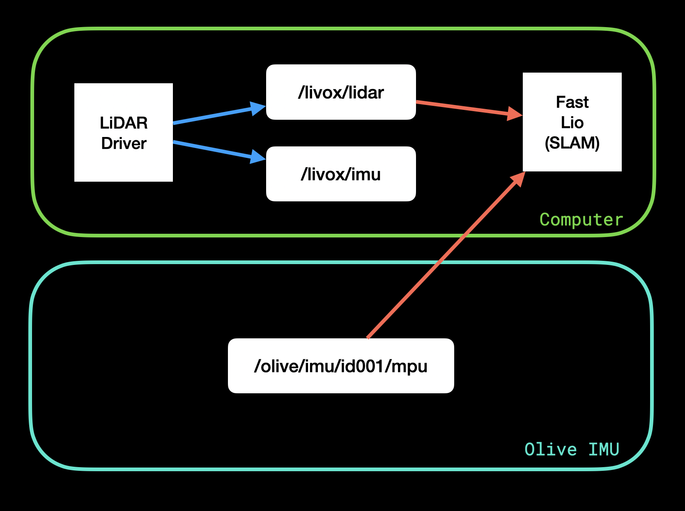

# SLAM


## 📚 Table of Contents
<!-- TOC -->
* [SLAM](#slam)
  * [📚 Table of Contents](#-table-of-contents)
  * [Special File Explanation](#special-file-explanation)
    * [`MID360_config.json`](#mid360_configjson)
    * [`mid_olive_imu.yaml`](#mid_olive_imuyaml)
  * [Installation](#installation)
    * [Olive IMU](#olive-imu)
    * [Possible Point of Confusion: Livox Driver Library](#possible-point-of-confusion-livox-driver-library)
    * [SLAM Configuration](#slam-configuration)
  * [Visualization](#visualization)
  * [Saving / Playback](#saving--playback)
    * [Completed File](#completed-file)
      * [Saving](#saving)
      * [Playback](#playback)
    * [History](#history)
      * [Saving](#saving-1)
      * [Playback](#playback-1)
<!-- TOC -->

## Special File Explanation

### `MID360_config.json`

This file will configure the IP addresses, as specified in the Livox MID 360 user manual (which can be found online).

For more information, check out the [Livox MID-360 Manual](https://www.livoxtech.com/mid-360/downloads).

Place the file here (delete the existing MID360_config.json in the same folder):
`ws_livox/src/FAST_LIO_ROS2/config`

### `mid_olive_imu.yaml`

This file will accomplish two things:
1. Change the file save location to the workspace where you run the command, in the file test.pcd
2. Change the FAST LIO program to use the Olive IMU for sensor readings, and not the LiDAR’s built in IMU

Place the file here:
`ws_livox/src/livox_ros_driver2/config`

## Installation

This diagram captures how the topics interact to run SLAM. We replace the built-in Livox IMU with the Olive IMU in a seamless
one-file change: adding the `mid_olive_imu.yaml` file to the configuration directory of the driver.


The configuration for the Livox LiDAR MID-360 Sensor with ROS 2 can be complicated. There are many repositories out there
that have been developed to bridge the communications between ROS and Livox sensors, but you must be careful to only look
at those that are targeted towards the MID-360 sensor, and for ROS 2.

### Olive IMU


The [olixSense™ X1 IMU](https://olive-robotics.com/olixsense-imu-x1/) is supported by the MID-360 Sensor and FAST LIO program.

Simply by plugging it in and remapping the FAST LIO program to subscribe to the X1 IMU topic (this is described in the [configuration files](#mid_olive_imuyaml), the program will function
perfectly, with the advantages of the IMU, like vibration-resistance and AI-enhanced directional heading.

### Possible Point of Confusion: Livox Driver Library

There are two repositories developed by Livox for use of driving their LiDAR sensors:
1. [livox_ros_driver2](https://github.com/Livox-SDK/livox_ros_driver2)  ✅
2. [livox_ros2_driver](https://github.com/Livox-SDK/livox_ros2_driver)  ❌

These look quite similar, but are designed for different LiDAR sensor classes.

For the MID-360, use the [livox_ros_driver2](https://github.com/Livox-SDK/livox_ros_driver2) repository.

To prepare your environment, follow all steps listed in the [livox_ros_driver2 README](https://github.com/Livox-SDK/livox_ros_driver2/blob/master/README.md)
This will entail setting up the Livox-SDK2 repository, as well.

### SLAM Configuration

Once you have set up the driver, you can move on to setting up the SLAM code.

For this project, the choice was made to go with Ericsii's ROS 2 version of a FAST_LIO implementation.

The repository, and its installation steps, are linked here: [FAST_LIO ROS 2](https://github.com/Ericsii/FAST_LIO_ROS2)

<br>

<details>
    <summary>Common Bugs while Configuring SLAM</summary>

There are a few problems you may encounter while setting this up. The most common ones, and their solutions, have been
listed below.

<br>

**1. CMake Error - ament_cmake_auto Not Found**

Solution: Add the following lines into the CMakeLists.txt of the livox_ros_driver2 code
```text
find_package(ament_cmake_auto REQUIRED)
ament_auto_find_build_dependencies()
```

<br>

**2. Missing rosidl_typesupport_c (type-support)**

Solution: Add the following lines into the CMakeLists.txt of the livox_ros_driver2 code
```text
set(ROSIDL_TYPESUPPORTS rosidl_typesupport_cpp)
```

<br>

**3. Missing pcl_ros dependency**

Solution: Run the following commands
```commandline
sudo apt update
sudo apt install ros-humble-pcl-ros
```

<br>

**4. Error: Process just dies instantly upon launching FAST LIO**

```bash
ros2 launch fast_lio mapping.launch.py config_file:=mid_olive_imu.yaml
[INFO] [launch]: All log files can be found below /home/olive/.ros/log/2025-07-10-10-20-39-057980-olive-7548
[INFO] [launch]: Default logging verbosity is set to INFO
[INFO] [fastlio_mapping-1]: process started with pid [7550]
[INFO] [rviz2-2]: process started with pid [7552]
[rviz2-2] qt.qpa.xcb: could not connect to display
[rviz2-2] qt.qpa.plugin: Could not load the Qt platform plugin "xcb" in "" even though it was found.
[rviz2-2] This application failed to start because no Qt platform plugin could be initialized. Reinstalling the application may fix this problem.
[rviz2-2]
[rviz2-2] Available platform plugins are: eglfs, linuxfb, minimal, minimalegl, offscreen, vnc, xcb.
[rviz2-2]
[fastlio_mapping-1] [INFO] [1752135639.385023265] [laser_mapping]: p_pre->lidar_type 1
[fastlio_mapping-1] Multi thread started
[fastlio_mapping-1] ~~~~/home/olive/ws_livox/src/FAST_LIO_ROS2/ file opened
[fastlio_mapping-1] [INFO] [1752135639.406197384] [laser_mapping]: Node init finished.
[fastlio_mapping-1] [WARN] [1752135639.535168409] [laser_mapping]: No point, skip this scan!
[fastlio_mapping-1]
[fastlio_mapping-1] IMU Initial Done
[fastlio_mapping-1] [WARN] [1752135639.635253563] [laser_mapping]: No point, skip this scan!
[fastlio_mapping-1]
[fastlio_mapping-1] [INFO] [1752135639.738655463] [laser_mapping]: Initialize the map kdtree
[ERROR] [rviz2-2]: process has died [pid 7552, exit code -6, cmd '/opt/ros/humble/lib/rviz2/rviz2 -d /home/olive/ws_livox/install/fast_lio/share/fast_lio/rviz/fastlio.rviz --ros-args'].
^C[WARNING] [launch]: user interrupted with ctrl-c (SIGINT)
[fastlio_mapping-1] catch sig %d2
[fastlio_mapping-1] Rebuild thread terminated normally
[INFO] [fastlio_mapping-1]: process has finished cleanly [pid 7550]
```

Solution: Write this in the terminal

```bash
export DISPLAY=:0
```

<br>

After attempting to fix any bug, be sure to rebuild your workspace using the following set of commands:
```commandline
source /opt/ros/humble/setup.bash
export CMAKE_PREFIX_PATH=/opt/ros/humble:$CMAKE_PREFIX_PATH
colcon build --symlink-install
```

</details>

<br>

## Visualization

To begin, open two terminal windows.

In the first, run the following commands:

```commandline
source ~/ws_livox/install/setup.bash
ros2 launch livox_ros_driver2 msg_MID360_launch.py
```

This will activate the driver, which starts the LiDAR publishing to a ROS 2 topic.

In the second terminal, run these commands:

```commandline
source ~/ws_livox/install/setup.bash
ros2 launch fast_lio mapping.launch.py config_file:=mid_olive_imu.yaml
```

This will begin the FAST LIO program, and launch rviz2, allowing you to visualize it.

The scripts `launch_driver.sh` and `launch_lio.sh` have been provided for your convenience in the `utility/scripts` folder.


## Saving / Playback

The specific configuration you use to save the Point Cloud file depends on how you want to interact with it afterwards.

If the time-component is important – being able to see how the point cloud was built up over time, then follow the steps
under [History](#history).

If you want to analyze the entire point cloud, follow the steps under [Completed File](#completed-file)

### Completed File

#### Saving

By default, your completed file will save to `{working_directory}/test.pcd`. This is configured in the `mid_olive_imu.yaml` file,
and can be adjusted as you wish.

If the real-time aspect of the data doesn't particularly matter to you, and you only need the final point cloud,
then follow these steps (taken from Steps 3.4 from the [FAST LIO](https://github.com/Ericsii/FAST_LIO_ROS2) repository).

1. Launch `rqt`
```commandline
rqt
```

2. In RQT, use the GUI to follow this path: `Plugins->Services->Service Caller`
3. Change the service to `/map_save`, and call it.
4. You should see a notice in the terminal where your FAST LIO program is running that the program is saving, along with
   the filepath that the program is saving to (you can customize this in your FAST LIO configuration).

#### Playback

If you saved it using the `/map_save` service, then you can quickly visualize the point cloud with the command:
```commandline
pcl_viewer {filename}.pcd
```

The PCL Viewer is quite powerful, and to see all the options it gives you, press `h` while the PCL Viewer window is in
focus.

For further analysis, like measuring the distance between points, we recommend using [MeshLab](https://www.meshlab.net/).

In order to use MeshLab, you will need to convert your file from a `.pcd` type to a `.ply` type.

This conversion can be completed with the following command:
```commandline
pcl_pcd2ply {input_file}.pcd {output_file}.ply
```

### History

#### Saving

Once the lidar driver is initialized, and the FAST LIO program is active, run the command:

```commandline
ros2 bag record /Laser_map
```

To end the recording, simply press Control + C in your terminal.

#### Playback

If you saved the data into a bag file, you will use the built-in ROS 2 utility to play it back.

In your terminal, type:

```commandline
ros2 bag play {bag_name}
```

This will simulate the topic you chose to record, in this case, `/Laser_map`, and play the data that went through it
back in real-time.

You can see an example of the data passing through it with
```commandline
ros2 topic echo /Laser_map
```

or alternatively can launch rviz2 and add a PointCloud2 visualization connected to the `/Laser_map` topic.
