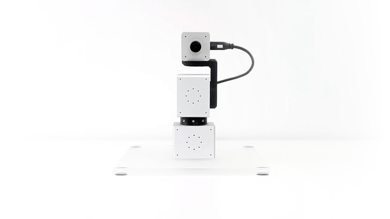

# Olive Educational Kit

This example shows the Olive OWL Educational Kit for ROS 2 in CPP and Python. For further informations check the [docs](https://olive-robotics.com/docs2/olvx-owl-educational-kit/)

   
